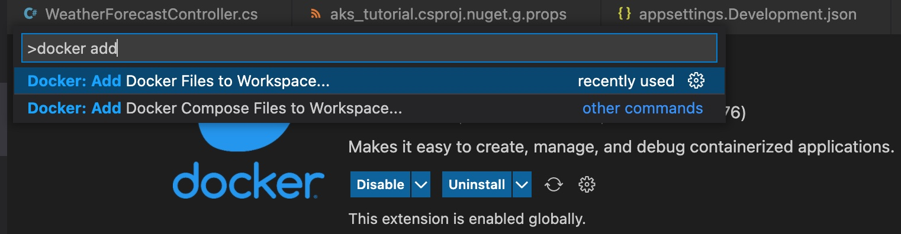

# aks_tutorial
The starting point to the code in this branch is the Microsoft document to create a simple ASP dotnet core web api that I found [here](https://learn.microsoft.com/en-us/aspnet/core/tutorials/min-web-api?view=aspnetcore-6.0&tabs=visual-studio-code). 

To run the code:
1. Clone the repository.
2. Switch to this branch: `git checkout start_here`
3. Start the app: `dotnet run`
4. On your browser, go to localhost: `https://localhost:<<portnumber>>/WeatherForecast`
The port number is printed on your console in step 3.

I used the `Docker` plugin to containerize the application

To test that things work fine in the containerized application, I created an image and ran it locally

1. `docker build -t aks_tutorial:v1 .`
2. List the docker images and check for the newly created image - `docker images`
3. Run the application: ` docker run -p 8080:5000 aks_tutorial:v1 ` - Note that `5000` is the port exposed in my Dockerfile
4. Go to browser and open `http://localhost:8080/WeatherForecast`

You now have a running dotnet core web-api that we will try to run on aks next.

### Push image to a container registry
Now that you have built a docker container image, you should make it available in a container registry that can be accessed by the Kubernetes cluster you will deploy on Azure. 

Use [this Microsoft document](https://learn.microsoft.com/en-us/azure/container-registry/container-registry-get-started-azure-cli) to create a private container registry.

1. az group create --name "aparna-ravindra-aks" --location westus
2. az acr create --resource-group "aparna-ravindra-aks" --name aparnacr007 --sku Basic  [Note the loginserver: `aparnacr007.azurecr.io`]
3. az acr login --name aparnacr007
4. docker tag aks_tutorial:v1 aparnacr007.azurecr.io/aks_tutorial:v1
5. docker push aparnacr007.azurecr.io/aks_tutorial:v1

You should now be able to see the repository created in the Container Registry in Azure Portal.

### Kubernetes resources
We add the deployment file required to run the application on Kubernetes. Ensure that you have the `Kubernetes` VS Code extension. This provides auto-complete feature that is very useful.

In the `image` field, enter the image pushed to the container registry in the previous step.

Test your setup by creating a AKS cluster manually by following the [Microsoft doc here](https://code.visualstudio.com/docs/azure/kubernetes#_create-and-config-a-kubernetes-cluster).

1. az aks create -n aks_tutorial -g aparna-ravindra-aks --enable-managed-identity --node-count 1
2. az aks install-cli
3. az aks get-credentials -g aparna-ravindra-aks -n aks_tutorial

Deploy the pod and service
kubectl apply -f pod.yaml

You can go to azure portal and find the external IP of your service and test it.
